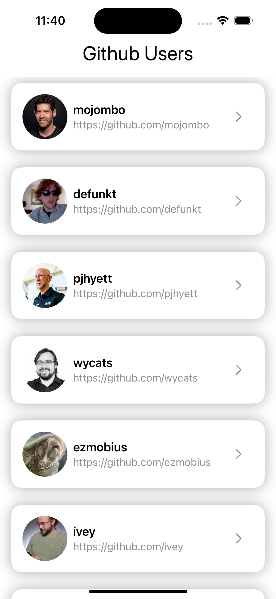

📝 TymeX iOS Assignment

🚀 Introduction

This is an iOS application developed for TymeX using SwiftUI and Combine following the MVVM architecture. The application fetches and displays a list of GitHub users, supports infinite scrolling, and allows viewing detailed user information.

<table>
  <tr>
    <td></td>
    <td></td>
  </tr>
  <tr>
    <td><strong>Home Screen</strong></td>
    <td><strong>Detail Screen</strong></td>
  </tr>
</table>

📌 Features

✅ The administrator can browse fetched users’ information.

✅ The administrator can scroll down to load more users, with 20 items per fetch.

✅ Cached user data is displayed immediately when launching the application for the second time.

✅ Clicking on a user item navigates to the User Detail page.

🛠 Technologies

SwiftUI

Combine

MVVM Architecture

URLSession for Networking

UserDefaults for Caching

🧪 Unit Tests

- [x] Network Service.
- [x] Cache Service.
- [x] Home Feature
- [x] Detail Feature

